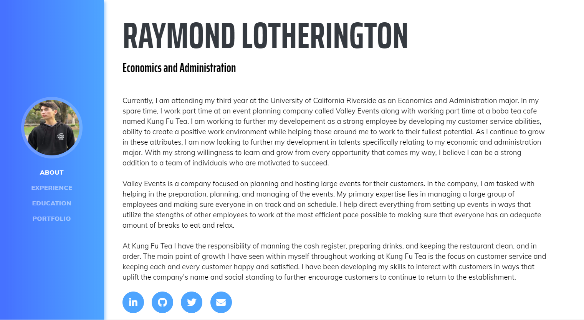

# Welcome to LearnCS8 Resume Website

# RaymondLotheringtonOnlineResume

I **REALLY** feel like this part of the lab needs some more explanation. I am not sure if *RaymondLotheringtonOnlineResume* works for a *Markdown Title*, but nothing really explained that part. Maybe I just missed it and didn't see what it meant by *Markdown Title*, but I am assuming it's the big, bold words above.

<!--So the image won't pop up even though the img is in the image folder and the command I am copying is 
 and I don't see what could be different about my
command. According to https://www.markdownguide.org/cheat-sheet/ the code for an image is
 (aka it took out the "img/") but that didn't work either. I even tried to
use a jpg image in case that was the problem but that didn't change anything. 
Probably doesn't change anything but there is the link to the actually screenshot
https://gyazo.com/81c7328a18bd32f6f4abe0285e4dd0d9 of the website, which the lab also didn't explain
how to do. I also copied the name directly from the file name so I know that's not
misspelled anywhere-->